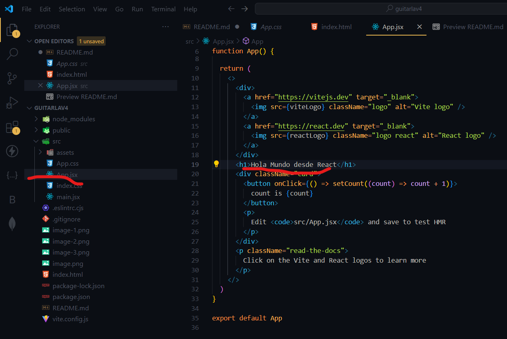
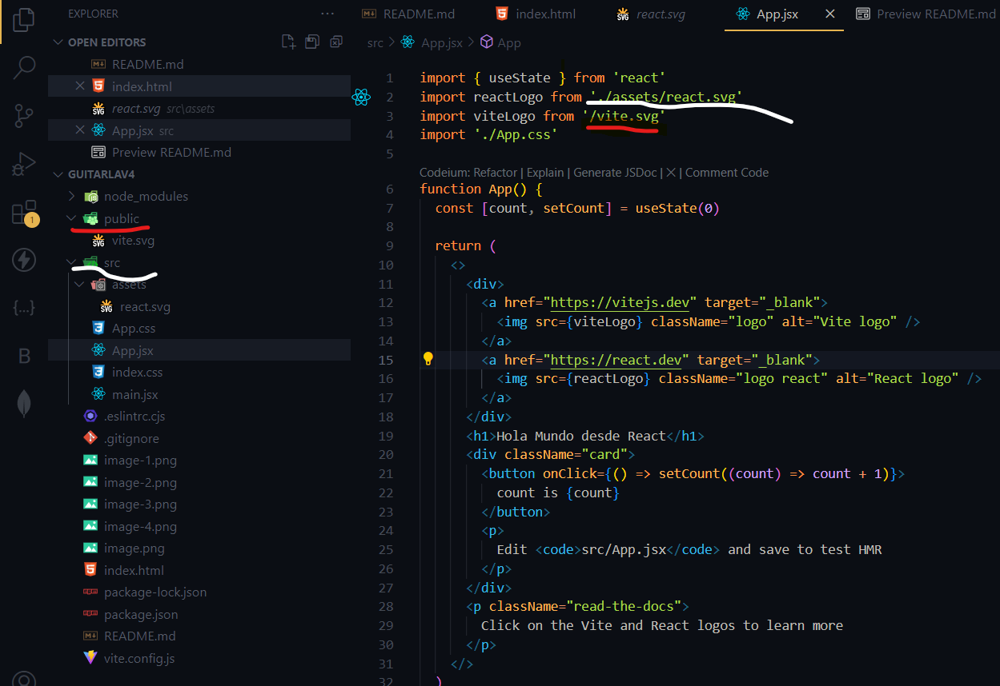
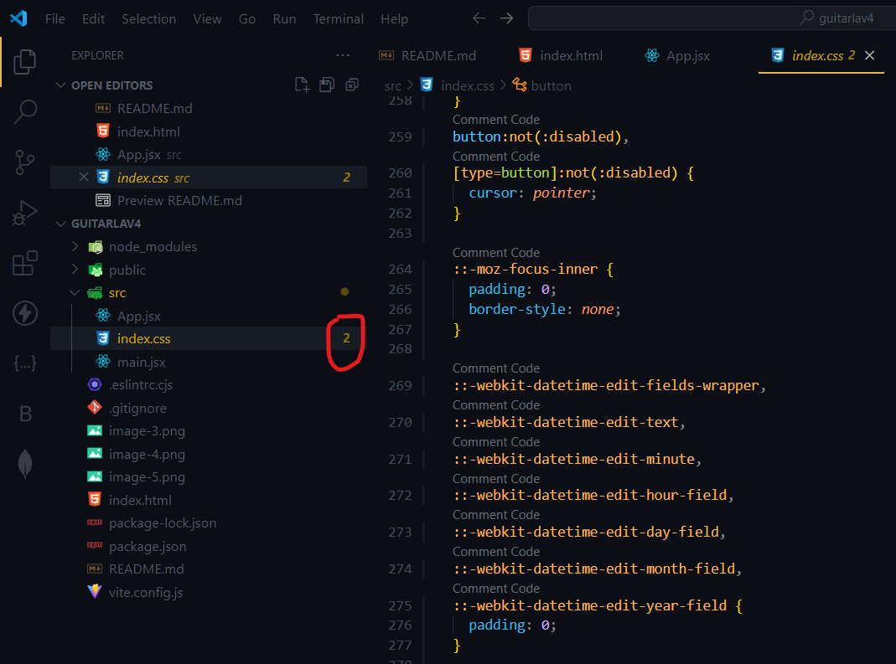

# Documentacion de este proyecto

This template provides a minimal setup to get React working in Vite with HMR and some ESLint rules.

Currently, two official plugins are available:

- [@vitejs/plugin-react](https://github.com/vitejs/vite-plugin-react/blob/main/packages/plugin-react/README.md) uses [Babel](https://babeljs.io/) for Fast Refresh
- [@vitejs/plugin-react-swc](https://github.com/vitejs/vite-plugin-react-swc) uses [SWC](https://swc.rs/) for Fast Refresh
# Aqui viene la explicacion Seccion 6
## Como iniciar el proyecto 
se escribe npm create vite@latest

Para hechar a andar el proyecto

npm install,

npm run dev

desde aqui se hacen los cambios de los letreros

Si quiero usar el directorio de src, se escribe ./y la ruta

Si quiero usar el public, va directo, segun la siguinte imagen

HMR = Hot Model Replacement

Este numero significa que hay 2 problemas

## para el repositorio
dentro del directorio donde se tiene el proyecto

git init

me quede en el video 55